# Online Ordering System

## Description

OOS is a robust e-commerce app designed for Android devices running API 24 _"Nougat"_ or higher. Built with a focus on user experience, it offers a seamless shopping journey in portrait view. The app features five distinct product categories; Clothes, Accessories, PC Parts, Gadgets, and House Furniture; each with a diverse range of items for users to explore and purchase.

Utilize the efficient search functionality to find products by name and apply category filters for a refined shopping experience. The integrated cart system allows users to manage their selections, adjust quantities, and choose their preferred mode of payment. User accounts enable secure login, registration, and profile management, including password updates and account information editing.

After purchase, detailed receipt information is provided, including store name, shipping fees, address, and transaction ID. OOS leverages SQLite3 for seamless database functionality, ensuring a smooth and reliable shopping experience.

### Developers

- [DragunWF](https://github.com/DragunWF) - **Back-End Developer, Leader**
- [JasDevPH](https://github.com/JasDevPH) - **Front-End Developer, UI/UX Designer**
- [n-ginan](https://github.com/n-ginan) - **Back-End Developer, Assistant**

## Features

### Specifics

- Primarily Tested for Portrait View
- Android API 24 _"Nougat"_

### Core

- 5 different choices of products, with 4-5 Variety (Items) on each choice for the user to buy
  1. Clothes
  2. Accessories
  3. PC Parts
  4. Gadgets
  5. House Furniture
- Item search functionality by product name
- Product filtering via category
- Item cart that will have the list of items chosen by the customer
- Users can choose a mode of payment when buying products
- Can edit the quantity of the product ordered
- Viewable customer details
- Viewable shop details
- Viewable product details
- Users can login & register in the mobile app
- Users can update their password and edit other parts of their account information
- Users can see the availability of a product
- Receipt details shown after the user buys products
  1. Name of the store
  2. Shipping fee
  3. Address
  4. Transaction ID
- SQLite3 Database

### SQLite3 Entity Relationship Model

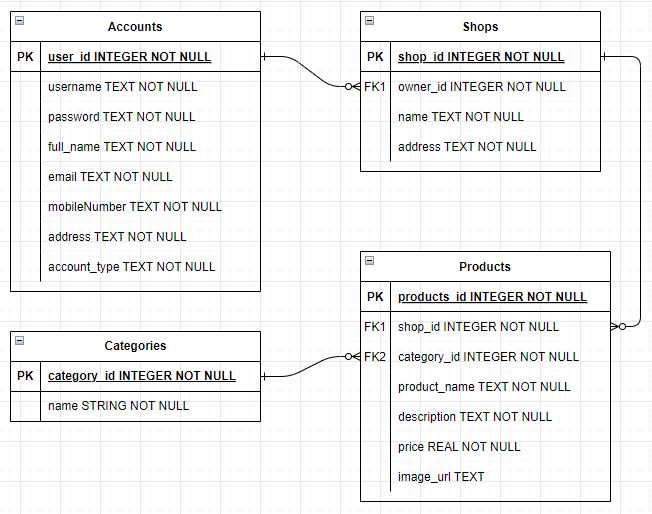

---

## Images of the App

### Landing, Login, and Registration Page

  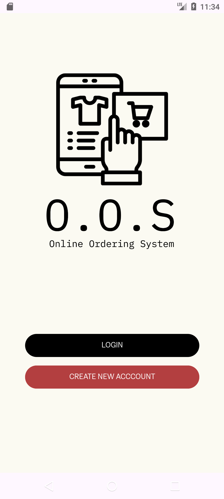
  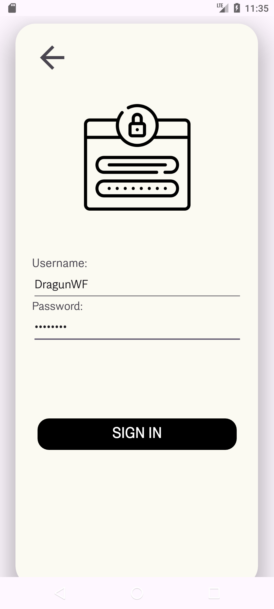
  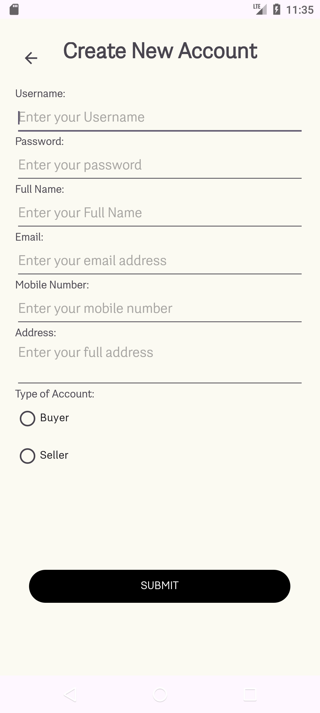

### Product Page

  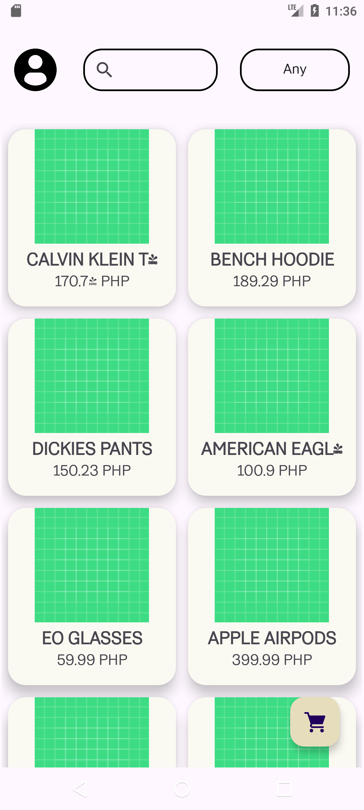
  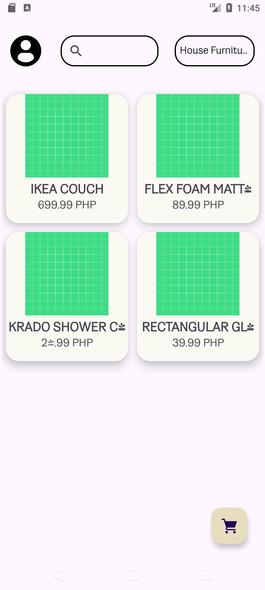
  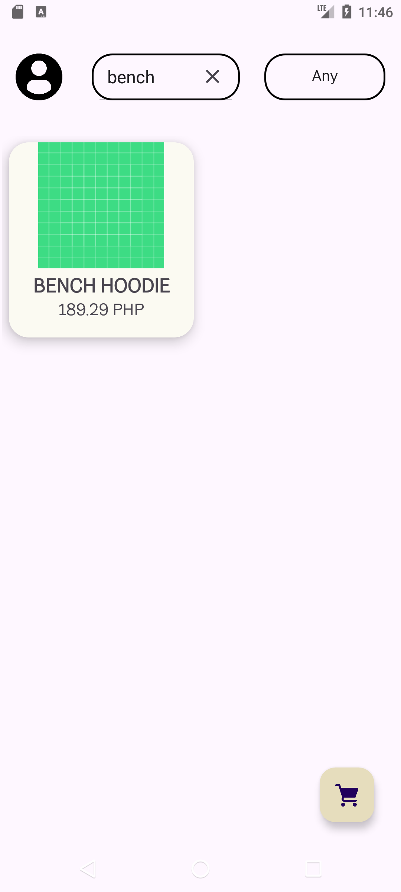

### Individual Item and Item Cart Page

  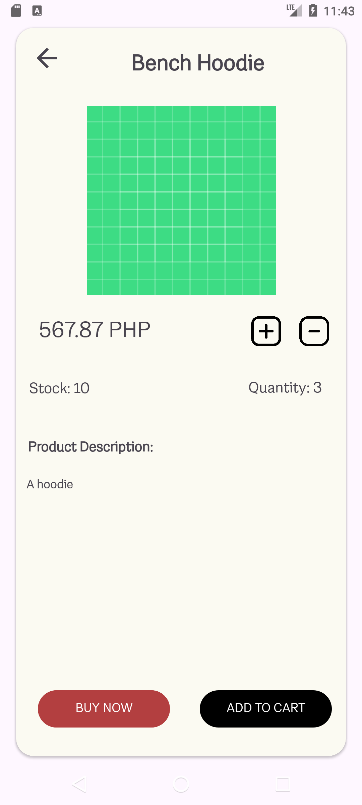
  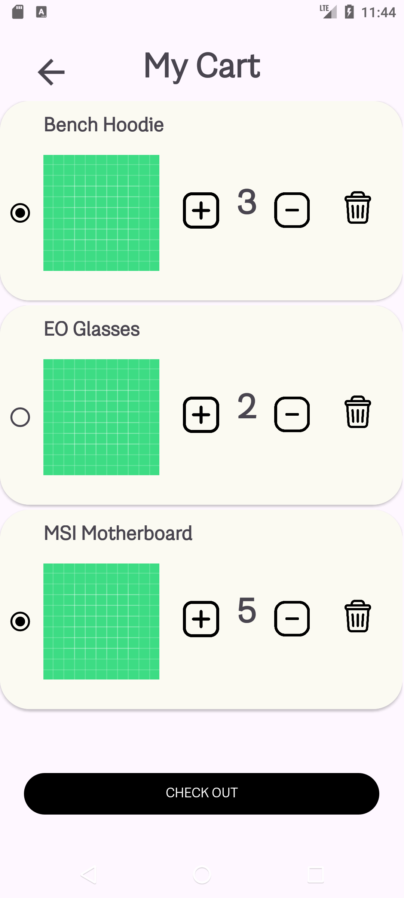

### Checkout and Receipt Page

  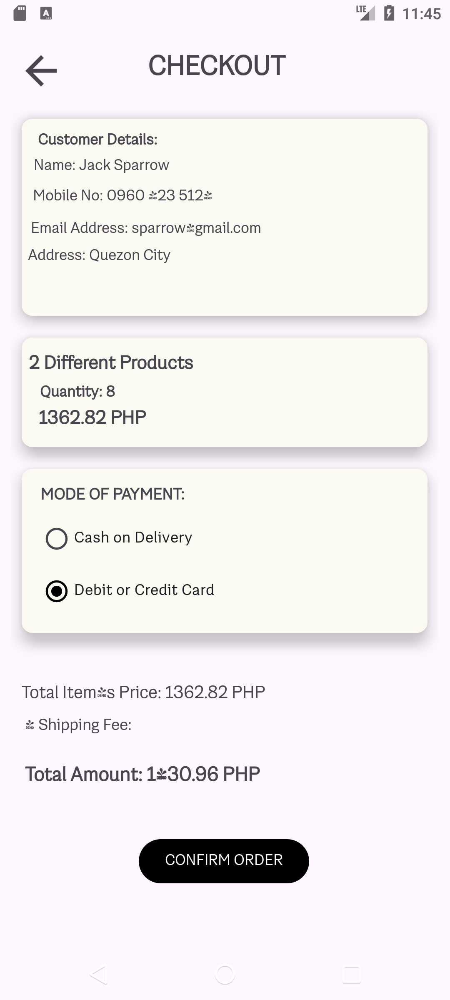
  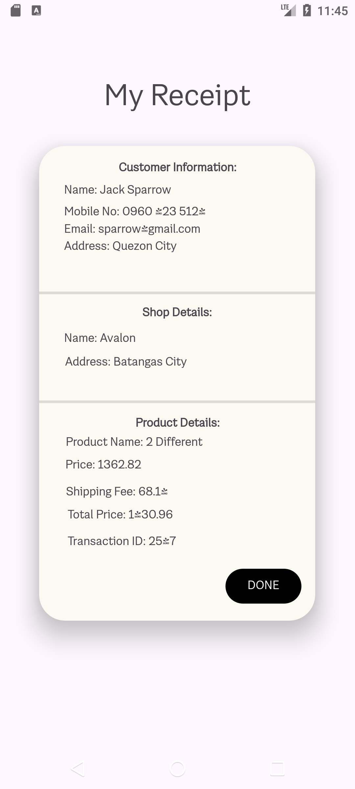

### Profile, Edit Profile, and Edit Password Page

  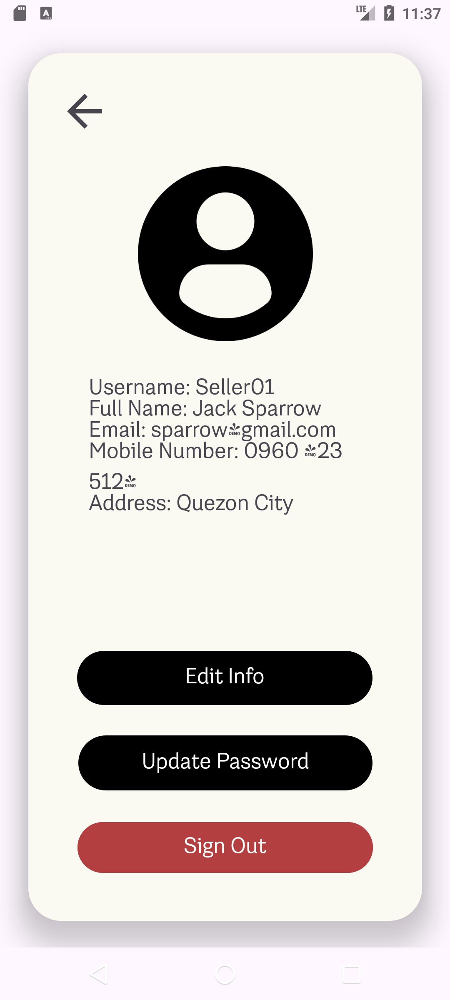
  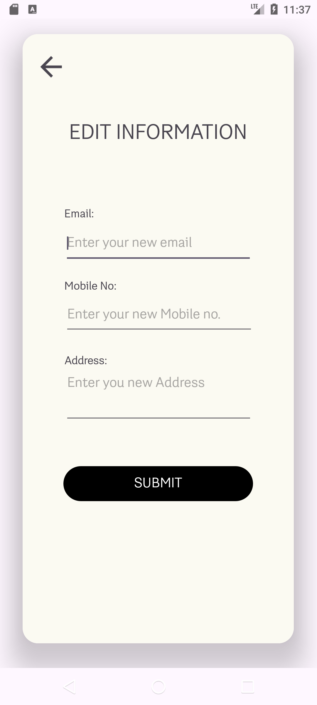
  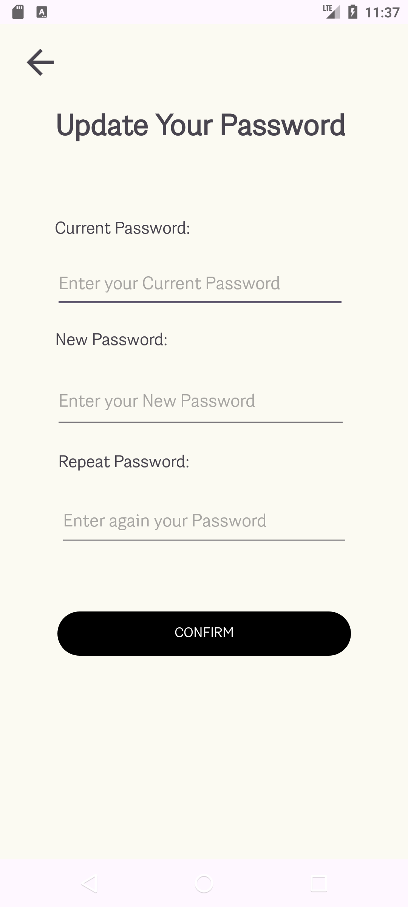

## O.O.S Logic Flow Chart

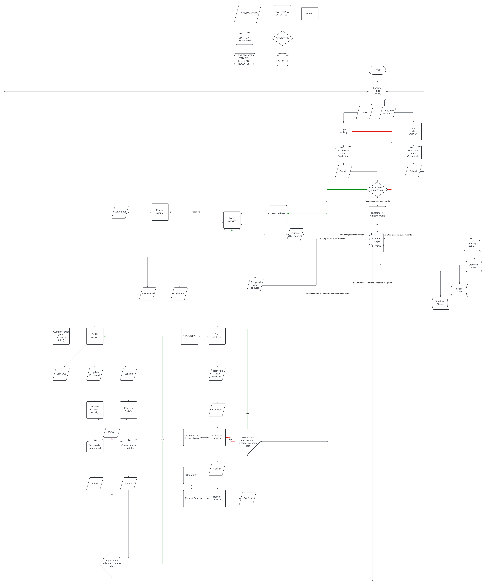

## Disclaimer

_This is not actually online but it is more of a simulated experience._
